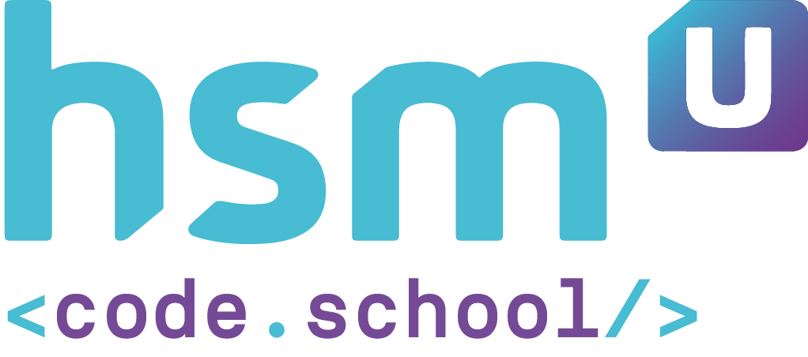

## 🚀 Atividade

Em um processo seletivo para trainee em uma fintech, foi solicitada a criação de um programa que permita calcular as médias dos valores de ações na bolsa ao longo de um mês.

Nesse caso, considere que os meses têm 28 dias e quatro semanas.

O programa deve apresentar as médias semanais (a menor e maior) e mensal.

---

# 📚 O que eu aprendi com o projeto!

- Identação de código;
- Percorrer indices do array;
- Trabalhar com matrizes
- Trabalhar com condicionais composta e múltiplas;
- Realizar operações aritméticas em Java;
- Arredondar valores e duminuir casas decimais utilizando a class DecimalFormat.

# 💻 Tecnologias

<a href='https://www.oracle.com/java/technologies/'>Java</a>
 
<a href='https://netbeans.org/'>NetBeans</a>
 

# 📝 Sobre o projeto

Este é um projeto acadêmico. Seu principal objetivo é facilitar a avaliação dos professores.

---

O aprendizado é contínuo e o próximo nível nunca será o último 🚀 by [aalvs](https://app.rocketseat.com.br/me/aalvs).